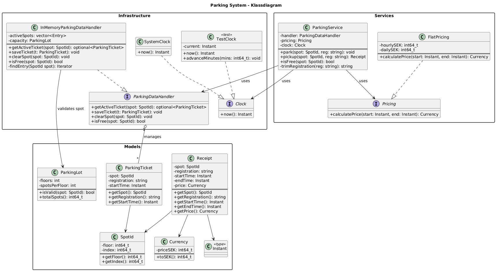

# Parking System (C++ Kodtest)

Ett enkelt system för att hantera parkering av intergalaktiska rymdskepp.
Systemet låter användaren registrera när ett skepp parkeras och hämtas, och beräknar priset automatiskt.

---

## Kravtolkning

Vid parkering anger användaren endast **parkeringsplats** och **registreringsnummer**.
Systemet hanterar **datum och tid** automatiskt via `Clock::now()`.

Vid hämtning anger användaren samma uppgifter. Systemet hämtar den tidigare registreringen, beräknar priset enligt reglerna och returnerar ett **kvitto** med angivna uppgifter, starttid, sluttid och pris.

---

## 🧩 Bygga och köra

**Krav:** CMake ≥ 3.16, C++20, Catch2

Använd medföljande bash script:
```bash
bash run.sh
```
eller bygg manuelt:

```bash
rm -rf build
mkdir -p build
cd build
cmake ..
make run_tests && echo "Success" || echo "Fail"
./build/tests/run_tests -s
```

## Designöversikt

Systemet är uppbyggt med en **modulärt i tre delar**:

- **Models** – Basic data models: `SpotId`, `ParkingTicket`, `Receipt`, `Money`, `ParkingLot`
- **Services** – Affärslogik: `ParkingService`, `Clock` (interface), `ParkingDataHandler` (interface), `Pricing` (interface)
- **Infrastructure** – Implementationer:
  `InMemoryParkingDataHandler`, `FlatPricing`, `SystemClock`, `TestClock`

`ParkingService` använder beroendeinjektion, vilket gör systemet **testbart och utbyggbart**.

---

## Antaganden

- Systemet sätter tiden automatiskt, användaren anger endast plats & registreringsnummer
- Prisregler:
  - Om tiden är under 24 h → 15 kr per påbörjad timme
  - Om tiden är 24h eller mer → 50 kr per påbörjat dygn (24h -> 50 kr, 24h, 1min -> 100 kr)
- `end < start` kastar `std::invalid_argument`
- Ingen databas eller GUI, single-threaded körning

---

## 🔁 Utökningar

- Ny prispolicy t.ex förändras efter tid på dygn eller veckodag.
- Ny lagring t.ex i filsystem eller SQL
- GUI eller REST-API
- Datalagring i databas

---

## 🧩 UML och sekvensdiagram

**Klassdiagram**  


**Sekvens – Parkering**  


**Sekvens – Hämtning**  


---

📄 **Författare:**
Albin Nilsson
_(Rekryteringstest – C++ Parking System)_